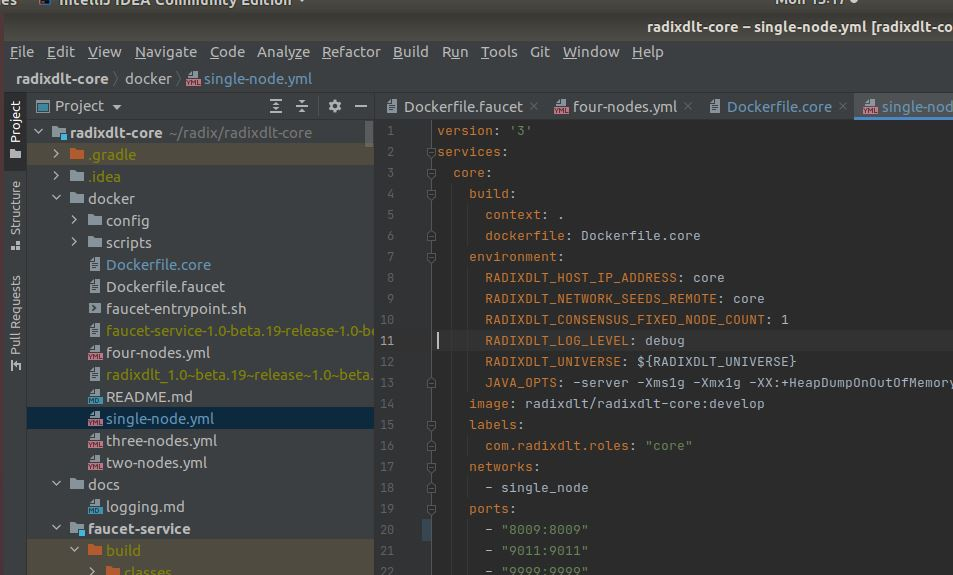
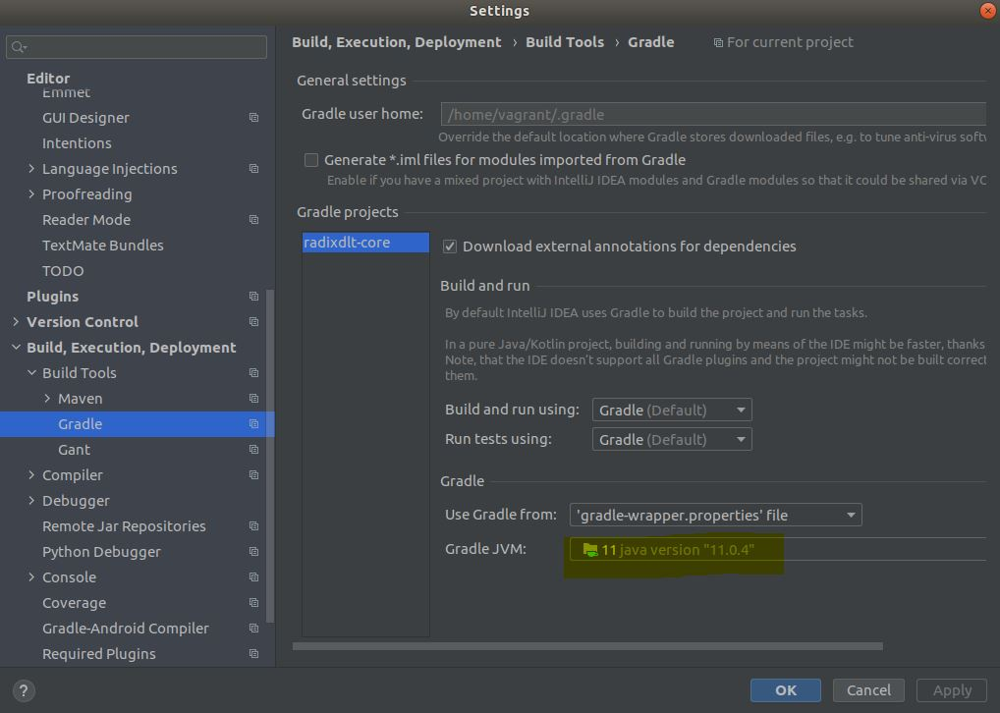
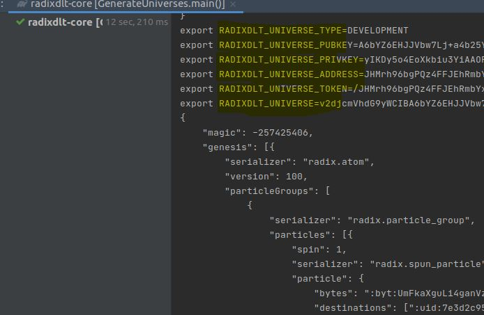
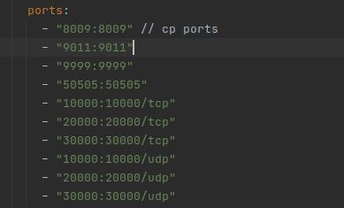
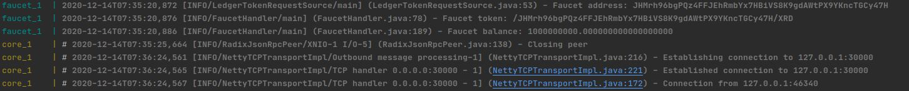
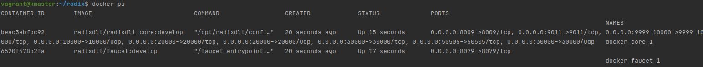
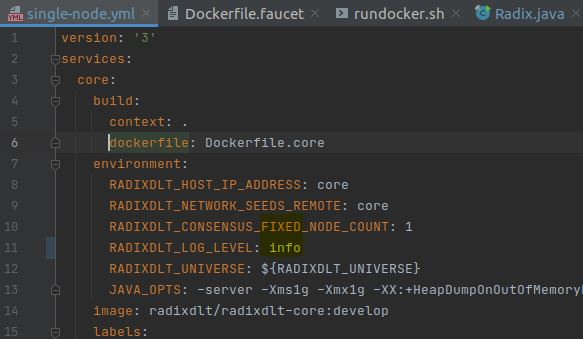
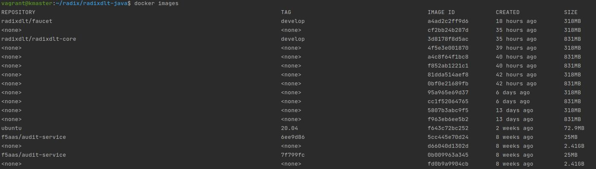

Table of Contents
=================

  * [Introduction](#introduction)
  * [Impressions of radix code base](#impressions-of-radix-code-base)
  * [Code base](#code-base)
  * [IDE Instructions](#ide-instructions)
  * [Build packages](#build-packages)
  * [Radix Universe Config](#radix-universe-config)
  * [Generate Radix local universe config](#generate-radix-local-universe-config)
  * [Customize Radix OOTB port configurations](#customize-radix-ootb-port-configurations)
  * [Radix universe config env cheat sheet](#radix-universe-config-env-cheat-sheet)
  * [Radix docker cheat sheet](#radix-docker-cheat-sheet)
  * [Accessing docker logs directly](#accessing-docker-logs-directly)
  * [Radix api cheat sheet](#radix-api-cheat-sheet)
  * [Instructions to generate radix identity](#instructions-to-generate-radix-identity)
  * [Receive XRD tokens via fauecet url](#receive-xrd-tokens-via-fauecet-url)
  * [Sample program to observe the actions performed on particular Radix Address](#sample-program-to-observe-the-actions-performed-on-particular-radix-address)
  * [Troubleshoot Instructions](#troubleshoot-instructions)
  * [Things not to do](#things-not-to-do)
  * [Radix CLI usage](#radix-cli-usage)
  * [Teardown Instructions](#teardown-instructions)
  * [Contact](#contact)
  * [Support the work](#support-the-work)
  * [Next Steps](#next-steps)
  * [Feedback](#feedback)
  * [End note](#end-note)


## Introduction
A quick guide to setup radix dev environment in local, this document contains the code to generate a new local radix identity and get tokens from fauecet service. ( Couple of instructions and my first impressions on how it feels to dwell in radix code realm )
- Control flow:   
  Radix local collocated bootstrap node,fauecet service -> Generate and save radix identity to filesystem -> Load radix identity -> Receive tokens from fauecet

##### NOTE : The following instructions augments the official radix repo's readme instructions.

## PreRequisites
- Install Open jdk 11 or Oracle jdk 11 ( ensure to set java_home and add it to path )
- Install latest gradle version
- Install Docker
- Download Intellij community edition (free version - in case if you would like to see the code )

## Code base
- Post RPN-1 code drop 2 individual branches has been archived and the code is maintained under single repo - [MonoRepo](https://github.com/radixdlt/radixdlt-parent)
- `git clone https://github.com/radixdlt/radixdlt-parent`
- ~~Clone radix core repository - [Core](https://github.com/radixdlt/radixdlt-core)
- ~~Clone radix dlt java , java-common , engine-library - [Repos](https://github.com/radixdlt)

## IDE Instructions
- Import the cloned folders into intellij as projects preferably in separate windows.
  
- If gradle is installed and is part of the system path then ide will automatically build / download gradle dependencies of project to your local system. Ensure gradle jvm is set correctly.
 

#### Build packages  ####
- ./gradlew deb4docker 
-  Took good amount of time to pull and build and bring up the node which involves downlaoding 
   ubuntu 20.04 , installs openjdk11 headless etc

#### Release beta-1.0.21 update ####
- Switch to branch >1.0.21 for easier convinience of running radix nodes in your local [](https://github.com/radixdlt/radixdlt-core/tree/release/1.0-beta.21)
- It's as simple as this command `./docker/scripts/rundocker.sh 2` ( second parameter is the number of nodes that you would like to boot up through docker-compose mode)
- This new command supports upto running 5 nodes in local.

## Radix Universe Config ##
- To run radix environment in local it is required to set the universe configuration through environment variables.
### Generate Radix local universe config ###
- Generate radix universe config in your local by running the main method of class `radixdlt/src/main/java/org/radix/GenerateUniverses.java`

- `RADIXDLT_UNIVERSE_TYPE` => name of the environment
- `RADIXDLT_UNIVERSE_PUBKEY` => public key of radix universe
- `RADIXDLT_UNIVERSE_PRIVKEY` => private key of radix universe
- `RADIXDLT_UNIVERSE_ADDRESS` => universe xrd wallet address
- `RADIXDLT_UNIVERSE_TOKEN` => An RRI aka Radix resource identifier of native platform token i.e XRD.
- `RADIXDLT_UNIVERSE` => serialized base64 byte content of radix universe configuration


***NOTE***  Run the following commands from the root folder of repo radixdlt-core

## Customize Radix OOTB port configurations
- To run radix components in local on different ports , try editing single-node.yml contents 

- Ensure to change the source java files (find the appropriate env that these port binds to from radix code base through ide file search , relevant configs/default.config.envsubst)
- Build the docker image again with command `./gradlew deb4docker`

## Radix universe config env cheat sheet ###
```shell
export RADIXDLT_UNIVERSE_TYPE=DEVELOPMENT
export RADIXDLT_UNIVERSE_PUBKEY=XYZ
export RADIXDLT_UNIVERSE_PRIVKEY=XYZ
export RADIXDLT_UNIVERSE_ADDRESS=XYZ
export RADIXDLT_UNIVERSE_TOKEN=XYZ
export RADIXDLT_UNIVERSE=XYZ
```

**Note:** actual values are intentionally omitted as am not sure whether i could post them in public domain.

### Radix docker cheat sheet ###
- To build and run the fauecet service , radix bootstrap node
```
$ docker-compose -f docker/single-node.yml up --build  
```
You should see fauecet and core container connection established successfully 

- To stop a current running docker compose collocated containers , issue sig_interrupt/stop/ctr+c in the terminal and run the following command to remove the traces of default network created.
```
$ docker-compose -f docker/single-node.yml down
```

## Accessing docker logs directly
Logs are accessible via terminal with following commands
```
$ docker ps # list of running active containers 
$ docker logs {container_id} # View the logs
```



### Radix api cheat sheet ###
```
# Get the devnet tokens deposited to a radix address by calling fauecet service
$ wget http://localhost:8079/api/v1/getTokens/{address}
     (OR)
$ curl http://localhost:8079/api/v1/getTokens/{address}

# Get the radix universe config details in a readable format
$ curl http://localhost:8080/api/universe  
```

# Instructions to generate radix identity
- Clone radix-dlt-java and create a new file GenerateIdentity.java in under examples folder and copy/paste the below code to generate a new radix identity/address. (the following program requires a running docker-compose version of radix dlt)
```Java
package com.radixdlt.client.examples;

import com.radixdlt.client.application.identity.RadixIdentities;
import com.radixdlt.client.application.identity.RadixIdentity;
import java.io.FileWriter;
import java.io.IOException;
import java.io.PrintWriter;

public class GenerateIdentity {
public static void main(String[] args) {
        try {
            generateNewIdentity();
            // load the generated identity
            RadixIdentity id = RadixIdentities.loadOrCreateFile("mozhi");
            // Initialize api layer
            RadixApplicationAPI api = RadixApplicationAPI.create(Bootstrap.LOCALHOST, radixIdentity);
            // Sync with network
            api.pull();
            System.out.println("My address: " + api.getAddress());
            System.out.println("My public key: " + api.getPublicKey());
        } catch (Exception e) {
            e.printStackTrace();
        }
    }
    // Generate a new radix identity and store the eckeypair in a file `mozhi`
    private static void generateNewIdentity() throws IOException {
        String password = "mozhibateman";
        FileWriter fileWriter = new FileWriter("mozhi");
        PrintWriter writer = new PrintWriter(fileWriter);
        try {
            RadixIdentities.createNewEncryptedIdentity(writer, password);
        } catch (Exception e) {
            System.out.println("Unable to generate keys due to following error:\n" + e.getMessage());
        }
        writer.flush();
        writer.close();
    }
}
```

## Receive XRD tokens via fauecet url #
- Copy the address from the aforementioned program and hit fauecet url  
```shell
$ curl http://localhost:8079/api/v1/getTokens/JHMuR2BkNX3k5Gcvg6ARU1KcGoKv6kQiiBuZ1NPcoZCRYv368SZ
```
## Sample program to observe the actions performed on particular Radix Address
```java
final  RadixIdentity radixIdentity = RadixIdentities.loadOrCreateFile("mozhi");
// Sync with network
api.pull();

System.out.println("My address: " + api.getAddress());
System.out.println("My public key: " + api.getPublicKey());

api.observeBalance(api.getNativeTokenRef())
        .subscribe(balance -> System.out.println("My Balance: " + balance));

// Print out all past and future messages on radix address
api.observeMessages().subscribe(System.out::println);
// observe the network state transistions
api.getNetworkState().blockingSubscribe(System.out::println);
```
```shell
Output: 
My address: JHMuR2BkNX3k5Gcvg6ARU1KcGoKv6kQiiBuZ1NPcoZCRYv368SZ
My public key: ECPublicKey[A6bzr4iIGCzRi1ATdoWIK5BJJt7FhWFN0NNp/HNXvE92]
JHMrh96bgPQz4FFJEhRmbYx7HBiVS8K9gdAWtPX9YKncTGCy47H -> JHMuR2BkNX3k5Gcvg6ARU1KcGoKv6kQiiBuZ1NPcoZCRYv368SZ: DECRYPTED U2VudCB5b3UgMTAgWFJE
My Balance: 10.000000000000000000
{localhost:8080=RadixNodeState{node='localhost:8080', status=DISCONNECTED, data=null, universeConfig=null}, localhost:8081=RadixNodeState{node='localhost:8081', status=DISCONNECTED, data=null, universeConfig=null}}
{localhost:8080=RadixNodeState{node='localhost:8080', status=DISCONNECTED, data=null, universeConfig=null}, localhost:8081=RadixNodeState{node='localhost:8081', status=DISCONNECTED, data=null, universeConfig=null}}
{localhost:8080=RadixNodeState{node='localhost:8080', status=CONNECTING, data=null, universeConfig=null}, localhost:8081=RadixNodeState{node='localhost:8081', status=DISCONNECTED, data=null, universeConfig=null}}
{localhost:8080=RadixNodeState{node='localhost:8080', status=CONNECTED, data=null, universeConfig=null}, localhost:8081=RadixNodeState{node='localhost:8081', status=DISCONNECTED, data=null, universeConfig=null}}
````

## Troubleshoot Instructions
- Radix docker compose spits a lot of logs that may be too clunky at times , to disable the noise of excessive logging set `RADIXDLT_LOG_LEVEL` to `info`. Allowed log level values (off , fatal , error , warn , info ,debug , trace , all)
 
- Ensure to setup java_home as required.
- Make sure there is enough disk space left on host operating system.
- Keep an eye on docker logs of respective docker containers.

## Things not to do ##
- To save initial time of getting acquainted with environment , try to avoid customizing configurations/changing the code and rebuilding the source for generating docker images.
- Try to spend time on why the default instructions are not working.
- Go through the readme in official repositories [README](https://github.com/radixdlt/radixdlt-core/blob/release/1.0-beta.20/docker/README.md)
- Don't try to run the Radix code entrypoints/main methods independently ( as it becomes difficult to connect the dots )
- Radix docker mode uses some port numbers , it is required to not run any services on those ports eg:8080,8079 to run the docker successfully. Terminate / change the port configurations appropriately.

## Radix CLI usage
TBD

## Teardown Instructions
- Remove docker images generated in the process of running radix docker env
  `docker rmi {image_name}`

- Remove any orphan docker images using the following command ( to reclaim the disk space )
  `docker rmi $(sudo docker images --filter "dangling=true" -q --no-trunc)`

## Contact
- Please reach out to radix devs on discord for more information and additional assistance.( I will look out for the messages on discord and assist to the best of my knowledge )
- Join the discussion [Discuss](https://github.com/mozhi-bateman/radix-dev-quick-starter/discussions/1)

## Support the work
EXRD / ETH                ~ `0xCD640383d2C662594bDeb8CDDad7e4aC18C9e921`   
BTC(nativesegwit)         ~ `bc1qp82940q5et0dv39s5yv8297zuv33xe4k7t0238`

## Next Steps
- Please let me know what you would like me to experiment with radix codebase.

# Feedback 
- Please let me know via discord. Username : `mozhi#0120`

## Impressions of radix code base
I predominantly coded in java in my professional experience , although at present I am working on GO lang. My initial impression of radix 
code base is pleasant with well documented methods , unit tests and instructions. It feels good to see declarative/reactive programming paradigms in radix code base.
RXJava2 code constructs were used heavily and Google guice inject framework was used to instantiate several objects. Overall the health of code base is in pretty good shape. 
Although no complaints / concerns except how Java Garbage collector STW cycles and its effect on radix dlt. ( Topic for another day)  

## End note

- I've always been in awe of what radix dlt aspires to be, ever since i joined their Telegram channel when there were around 84 members (fyi - the first TG channel has been archived, and the community moved onto the one which is present today). Initially the conversations were looming around how logical clocks , tempo will solve the scalability issues while the remaining crypto realm (without any r&d) running behind ICO drama to make quick bucks. And i throughly enjoyed peachy shawn explanations in layman terms about radix which kept me hanging dialy about something new. Dan's never ending commitment and sheer passion made me an ardent fanatic of Radix DLT.   
- I still rejoice the moments of those days when dan patiently answered the queries, explaining his ideas and discussing the future of crypto world, radix. Dan was particularly vehement about how things will fail with respect to dag , blocktrees , etc & kept on treading the treacharous paths to invent something remarkable. I vaguely remember conversation about dan's insights on better consensus model to make network secure ( fun fact: POS/DPOS are still in ideation/nascent phase by other crypto nerds at that time , point is that Dan always ahead of his contemporaries ). Not to mention dan had had strong fondness to java, and i hope coz of radix Java's name gonna be reverberated in the programming languages arena forever.Dan's battle on java gc and memory issues brought laughter to one of the community question then.I wonder how many battle's he had won against GC to the day.
- I remember the days of alpha launch , betanet emulator , desktop wallet and community's interest in seeing radix mainnet. Piers always laid the perfect pitch for radix in steering the direction towards right path , it takes real guts to lead a company with so many roadblocks in delivering the mainnet. 
- I wish Radix is gonna be the next big thing that becomes the driving factor in the crypto world for mass adoption.
````
Radix team(with whom i have interacted) comparision to snooker legends

         Dan Hughes     => Ronnie O'Sullivan
         Piers          => Jimmy White
         Joshua         => Kyren Wilson
         Peachy Shawn   => Judd Trump
